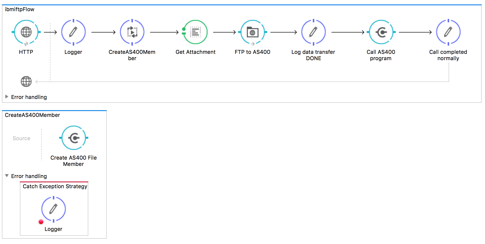

# How to send data to IBM i Multimember File with Mulesoft Anypoint

IBM i (AS/400, iSeries, System i) operating environment includes an integrated DB2 database that is widely used as an application data storage. The traditional IBM i languages work with "physical files" (DB2 tables) and "logical files" (DB2 views and indexes) using record level access operations (position, read single record by key, delete by key, update current record etc).

Typically the remote clients access IBM i data via DB2 SQL Query Engine / JDBC or ODBC interface. This works well for regular files / DB2 tables. However on a recent call with prospect I ran into a use case where the data needs to be pushed into a multi-member file. This is a special IBM i file type widely used in older IBM i (AS400) applications, that supports partitioning content into multiple "members" and provides methods for isolating the data for traditional IBM i programs. The challenge of interfacing with the multi-member files is that they cannot be easily accessed via standard SQL clients.

There are several "brute force" options for remotely creating and working with multi-member files in Mule, including:
- Custom Java or .Net code to implement record level access to specified member using IBM Toolbox for Java or IBM Access for Windows APIs
- Custom Java or .Net code to Create SQL alias pointing to specific member then use the alias instead of file name for SQL operations
- Use third party ETL tools such as GoAnywhere
- Create a standard IBM i DB2 staging files and transfer the data there, create custom IBM i program to copy data from staging to multi-member file on the back end

All options above are pretty straightforward for reasonable IBM i integration development team but still require quite a lot of custom coding either on Mule or IBM i sides. Fortunately, the IBM i shells view IBM i files in QSYS file system as directories, and file members as files. It can be seen in QSHELL screen by typing

```
QSHELL
cd /QSYS.LIB/DKUZNETSOV.LIB/TESTFTP.FILE
```

For multi-member file it will list something like:

```
> ls -l                                                                        
  total: 172 kilobytes                                                         
  -rwx---rwx  1 INFOPGMR  0                  4008 Jul 27 15:14 TEST01.MBR      
  -rwx---rwx  1 INFOPGMR  0                  4008 Jul 28 11:50 TEST123.MBR     
  -rwx---rwx  1 INFOPGMR  0                  1002 Jul 27 22:49 TEST123CLS.MBR  
  -rwx---rwx  1 INFOPGMR  0                  4008 Jul 27 22:51 TEST124.MBR     
  -rwx---rwx  1 INFOPGMR  0                  4008 Jul 27 22:58 TEST125.MBR     
  -rwx---rwx  1 INFOPGMR  0                     0 Jul 27 14:53 TESTDIMA.MBR    
  -rwx---rwx  1 INFOPGMR  0                     0 Jul 27 14:41 TESTFTP.MBR     
  $                                                                            

```

Armed with this knowledge, I was able to use standard Mule FTP connector to push data directly to a specific IBM i file member by using a path of **/QSYS.LIB/<my library>.LIB/<my file>.FILE/** and a target file name as **<my member>.MBR**

Finally, the AS/400 connector is used to dynamically create new member before sending the data, then calling IBM i processing program after the data transfer is completed.



To test the sample flow, execute the following CURL command or use an HTTP client such as Postman


**curl -X POST -H "Cache-Control: no-cache" -H "Content-Type: multipart/form-data" -F "file2member=@path_to_the_input_file" "http://localhost:8081/sendFile?memberName=new_member_name"**

Note that the Mule flow expects the attachment file name to be file2member - it can be easily modified to send any attached file. 
